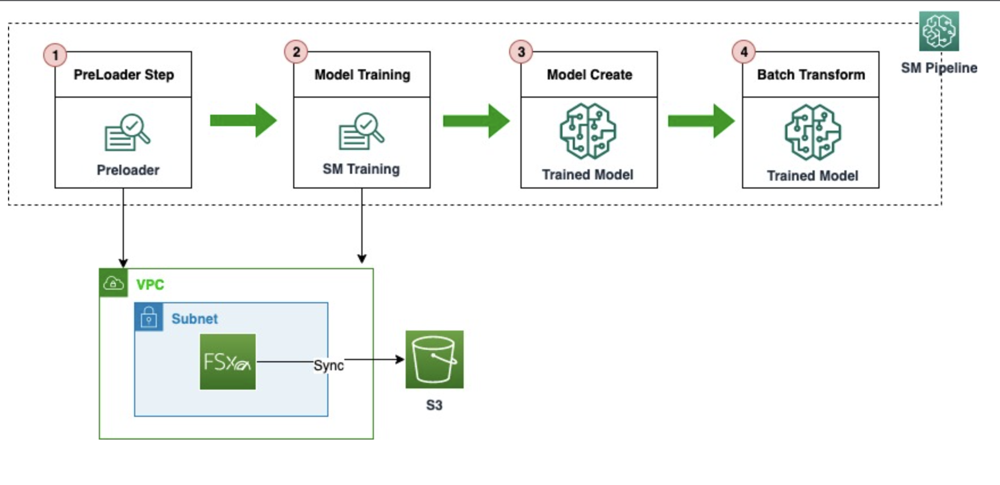

# SageMaker Pipeline Pre-load data onto FSx and training

Amazon SageMaker Pipelines provides ML developers and MLOps engineers configurable ability to orchestrate SageMaker jobs. The definition of the pipeline orchestration can be exported as a JSON object which represents domain acyclic graph (DAG). Amazon SageMaker provides the ability to integrate with Amazon FSx for Lustre to speed up the training jobs. Amazon FSx for Lustre can be linked to S3 and will automatically synchronize the files. Upon linking with S3, FSx copies files from S3 on-demand basis as they are accessed. Copy includes any file that is not in Fsx locally or if the source has changed since the last copy.  However, after the first epoch files should be fully copied and subsequent epochs should be faster (Assuming one epoch sweeps through the entire training dataset). After the training is done, the files are persistent in FSx and not removed automatically. Also as long as the files in S3 have not changed, ay subsequent runs will not copy the files from S3 to FSx.

One of the options to reduce the cost is to pre-load the files onto Fsx and initiate this from a cheaper instance before starting the training job.  This [page](https://docs.aws.amazon.com/fsx/latest/LustreGuide/preload-file-contents-hsm-dra.html) provides details.

This notebook illustrates how SageMaker training can be initiated with FSx storage using Pipelines and trigger preload of the files. In this notebook, we use Amazon SageMaker to train a convolutional neural network using PyTorch and the CIFAR-10 dataset, and then run SageMaker Batch transform on the trained model.

The steps in this pipeline include:

1. Pre load data into FSx file system
2. Train a Pytorch Model with the files preloaded
3. Persist the trained model
4. Batch Transform using the trained model

