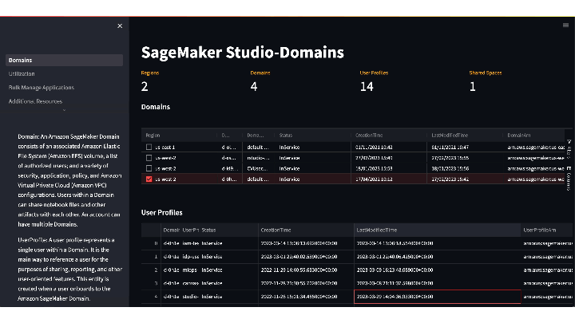
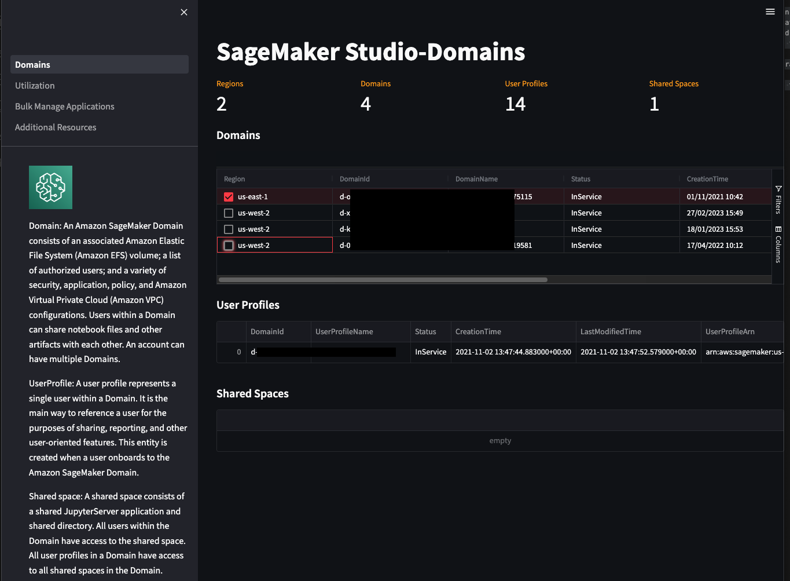
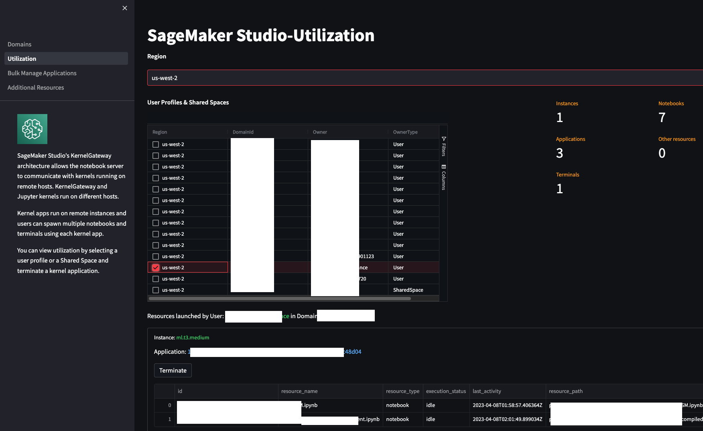
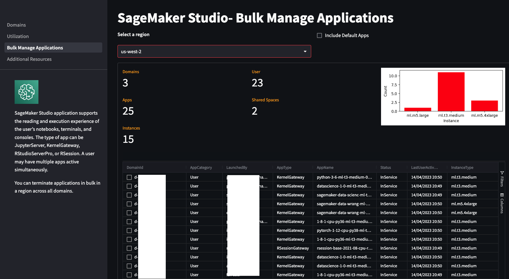

# Amazon SageMaker Studio Admin 

Amazon SageMaker Studio provides a web-based interface to perform end to end machine learning (ML) development steps starting from preparing data to deployment of ML models. SageMaker Studio users are onboarded to SageMaker Studio Domain. Following entities are part of this eco-system. 

* _Domain: An Amazon SageMaker Domain consists of an associated Amazon Elastic File System (Amazon EFS) volume; a list of authorized users; and a variety of security, application, policy, and Amazon Virtual Private Cloud (Amazon VPC) configurations. Users within a Domain can share notebook files and other artifacts with each other. An account can have multiple Domains._ 

* _UserProfile: A user profile represents a single user within a Domain. It is the main way to reference a user for the purposes of sharing, reporting, and other user-oriented features. This entity is created when a user onboards to the Amazon SageMaker Domain._ 

* _Shared space: A shared space consists of a shared JupyterServer application and shared directory. All users within the Domain have access to the shared space. All user profiles in a Domain have access to all shared spaces in the Domain._ 

* _App: An app represents an application that supports the reading and execution experience of the user’s notebooks, terminals, and consoles. The type of app can be JupyterServer, KernelGateway, RStudioServerPro, or RSession. A user may have multiple apps active simultaneously._

You can manage domains, users, shared spaces and applications in AWS SageMaker console. 
This application helps you to view the Domains across regions, User Porfiles & Shared spaces that are part of the domain, view applications and resources such as notebooks and terminals launched by users and manage them in bulk. 

## Functions
This portal is based on [Streamlit](https://streamlit.io/) and can be launched from SageMaker Studio. It has following pages

* SageMaker Studio-Domains- View Domains across regions and User Profiles and Shared Spaces
* SageMaker Studio-Utilization - View instances, Kernel applications, open session resources such as notebooks and terminals. Terminate the kernel applications.
* SageMaker Studio- Bulk Manage Applications- Manage kernel applications in a region across multiple domains.
* SageMaker Studio- Additional Resources- Links to Studio architecture, cost management and customization. 

To get started, open the notebook setup.ipynb.

## Screenshots

 

 

 

## FAQ

What is SageMaker Studio Admin?
- SageMaker Sudio admin application helps you to view the Domains across regions, User Porfiles & Shared spaces that are part of the domain, view applications and resources such as notebooks and terminals launched by users and manage them in bulk. This application provides complementing functions to AWS SageMaker console.

How does this application work?
- This application leverages SageMaker APIs to get information about Domains, User Profiles, Shared Spaces and to bulk delete kernel applications. In addition to this, this appliction uses Jupyter server REST API calls to get information about resources launched by a User or Shared Spaces. 

Can I view SageMaker Studio domains across regions?
- Yes. You can view SageMaker domains across multiple regions from the Domains page.

How do I access the application?
- You can follow the instructions in the notebook setup.ipynb. You can execute the instructions and launch the application

Can I view resources open by a User Profile?
- Yes. You can view the resources launched by a User Profile from the Utilizations page. Select a domain and a User Profile and you will be able to view the list of Instances, Kernel applications and Sessions launched by a user

Can I manage SageMaker Domain like Create, Delete from this application?
- No. This application provides complementing functions to SageMaker console. To manage SM domains, User Profiles, andf Shared Spaces use SageMaker Console.

Can I use this application to get information from other AWS accounts?
- No. This is not supported yet.

Can I terminate a notebook launched by a user from this application?
- No. However you can terminate a Kernel application used by session resources such as Notebooks. 

Does this application provide information on execution status of a notebook?
- Yes. This application provides execution status such as active, idle and last user activity on the resource.

Can I bulk terminate Kernel applications launched by a User?
- Yes. You can view applications launched in a region across multiple domains and bulk terminate them

